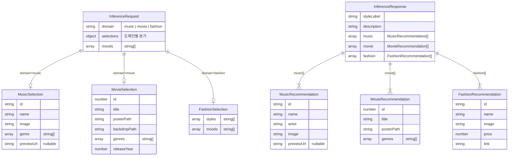

# Inference 스키마 명세

> Feature A — AI 추론 파이프라인 · Issue #52
> 최초 작성: 2026-05-31

---

## 개요

사용자가 선택한 **도메인**(음악·영화·패션)과 **취향 입력**을 받아 Grok AI가 크로스 도메인 스타일 추천을 반환하는 파이프라인의 입출력 계약을 정의합니다.

```
Client
  │
  ├── POST /api/inference
  │     body: InferenceRequest
  │
  └── ← InferenceResponse
```

---

## ERD



---

## EDD — Event Data Dictionary

### InferenceRequest

| 필드명 | 타입 | 필수 | 설명 | 예시 |
|---|---|:---:|---|---|
| `domain` | `"music" \| "movie" \| "fashion"` | ✅ | 사용자가 선택한 추론 기준 도메인 | `"music"` |
| `selections` | `MusicSelection \| MovieSelection \| FashionSelection` | ✅ | domain에 대응하는 취향 입력 객체 (discriminated union) | 아래 참조 |
| `moods` | `string[]` | ✅ | 사용자가 선택한 감성 태그 목록 | `["몽환적", "차분한"]` |

> `domain`과 `selections`의 타입은 반드시 일치해야 합니다. `domain: "music"`이면 `selections`는 `MusicSelection`이어야 합니다.

---

### MusicSelection (domain = "music")

| 필드명 | 타입 | 필수 | 설명 | 예시 |
|---|---|:---:|---|---|
| `id` | `string` | ✅ | Spotify 아티스트/트랙 ID | `"4Z8W4fKeB5YxbusRsdQVPb"` |
| `name` | `string` | ✅ | 아티스트 또는 트랙명 | `"Radiohead"` |
| `image` | `string` | ✅ | 커버 이미지 URL | `"https://i.scdn.co/..."` |
| `genre` | `string[]` | ✅ | 장르 목록 | `["alternative rock", "art rock"]` |
| `previewUrl` | `string \| null` | ✅ | 30초 미리 듣기 URL (없으면 null) | `"https://p.scdn.co/..."` |

---

### MovieSelection (domain = "movie")

| 필드명 | 타입 | 필수 | 설명 | 예시 |
|---|---|:---:|---|---|
| `id` | `number` | ✅ | TMDB 영화/시리즈 ID | `496243` |
| `title` | `string` | ✅ | 제목 | `"기생충"` |
| `posterPath` | `string` | ✅ | TMDB 포스터 경로 (`/` 시작) | `"/7IiTTgloJzvGI1TAYymCfbfl3vT.jpg"` |
| `backdropPath` | `string` | ✅ | TMDB 배경 이미지 경로 | `"/TU9NIjwzjoKPwQHoHshkFcQUCG.jpg"` |
| `genres` | `string[]` | ✅ | 장르명 목록 | `["드라마", "스릴러"]` |
| `releaseYear` | `number` | ✅ | 개봉 연도 | `2019` |

---

### FashionSelection (domain = "fashion")

| 필드명 | 타입 | 필수 | 설명 | 예시 |
|---|---|:---:|---|---|
| `styles` | `string[]` | ✅ | 선택한 스타일 키워드 목록 | `["미니멀", "스트릿"]` |
| `moods` | `string[]` | ✅ | 패션 도메인 전용 감성 태그 | `["시크한", "캐주얼한"]` |

---

### InferenceResponse

| 필드명 | 타입 | 필수 | 설명 | 예시 |
|---|---|:---:|---|---|
| `styleLabel` | `string` | ✅ | AI가 도출한 크로스 도메인 스타일 레이블 | `"Cinematic Minimalist"` |
| `description` | `string` | ✅ | 스타일 레이블에 대한 설명 문장 | `"조용하지만 강렬한 서사를 담은 ..."` |
| `music` | `MusicRecommendation[]` | ✅ | 음악 추천 카드 목록 | 아래 참조 |
| `movie` | `MovieRecommendation[]` | ✅ | 영화 추천 카드 목록 | 아래 참조 |
| `fashion` | `FashionRecommendation[]` | ✅ | 패션 추천 카드 목록 | 아래 참조 |

---

### MusicRecommendation

| 필드명 | 타입 | 필수 | 설명 | 예시 |
|---|---|:---:|---|---|
| `id` | `string` | ✅ | Spotify 트랙 ID | `"1TfqLAPs4K3s2rJMoCokcS"` |
| `name` | `string` | ✅ | 트랙명 | `"Karma Police"` |
| `artist` | `string` | ✅ | 아티스트명 | `"Radiohead"` |
| `image` | `string` | ✅ | 앨범 커버 이미지 URL | `"https://i.scdn.co/..."` |
| `previewUrl` | `string \| null` | ✅ | 30초 미리 듣기 URL (없으면 null) | `null` |

---

### MovieRecommendation

| 필드명 | 타입 | 필수 | 설명 | 예시 |
|---|---|:---:|---|---|
| `id` | `number` | ✅ | TMDB 영화/시리즈 ID | `68718` |
| `title` | `string` | ✅ | 제목 | `"Django Unchained"` |
| `posterPath` | `string` | ✅ | TMDB 포스터 경로 | `"/7oWY8VDWW7thTzWh3OKYRkWAYXO.jpg"` |
| `genres` | `string[]` | ✅ | 장르명 목록 | `["서부", "드라마"]` |

---

### FashionRecommendation

| 필드명 | 타입 | 필수 | 설명 | 예시 |
|---|---|:---:|---|---|
| `id` | `string` | ✅ | 상품 고유 ID | `"item_001"` |
| `name` | `string` | ✅ | 상품명 | `"오버핏 블랙 코트"` |
| `image` | `string` | ✅ | 상품 이미지 URL | `"https://unsplash.com/..."` |
| `price` | `number` | ✅ | 가격 (원 단위) | `89000` |
| `link` | `string` | ✅ | 상품 상세 페이지 URL | `"https://..."` |

---

## 도메인 흐름 요약

```
도메인 선택 (music | movie | fashion)
    ↓
취향 입력 (*Selection)
    ↓
감성 태그 선택 (moods: string[])
    ↓
POST /api/inference { domain, selections, moods }
    ↓
Grok AI 추론
    ↓
{ styleLabel, description, music[], movie[], fashion[] }
```
